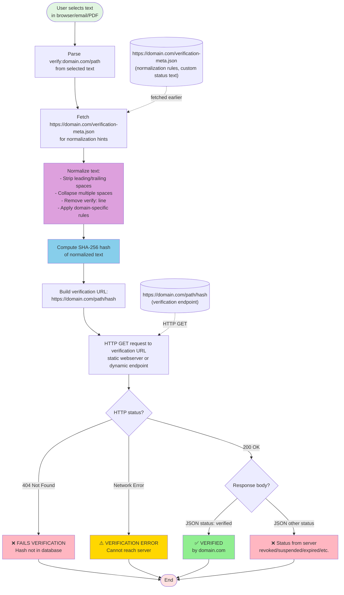
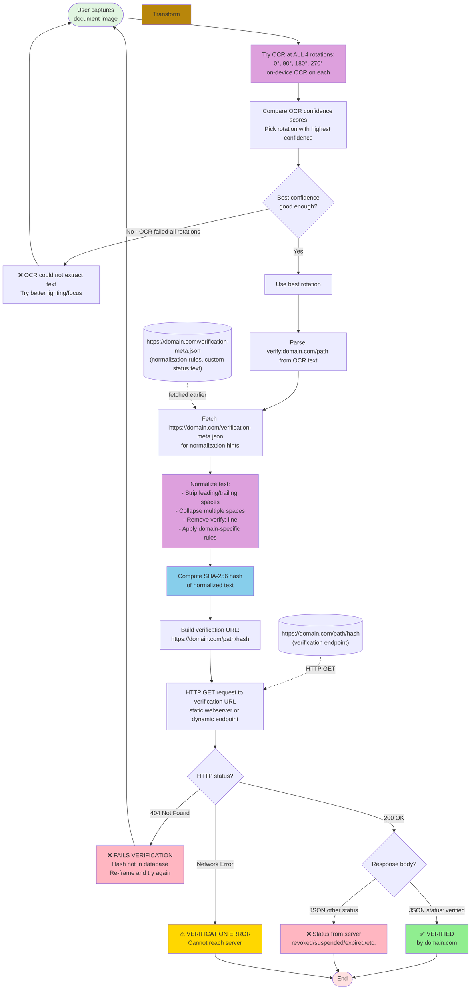

# How It Works

The `verify:` line in a document signals that verification is available. Both modes follow the same core pipeline: **text → normalize → hash → HTTP GET**.

## Clip Mode Pipeline (Browser Extension)



Clip mode is fast and reliable because the text is already digital — no OCR, no camera, no registration marks needed.

## Camera Mode Pipeline (Phone Apps)

Camera mode adds OCR and computer vision to extract text from physical documents:



Another day, we'll see if we can't get this working without a black border.

## Key Design Principles

**Variable element:** Each verifiable document needs something unique - a date/time, person's name, serial number, transaction ID, or other changing value. This ensures each certificate has a unique hash and prevents reuse of the same verification across different claims or brute force guessing of valid hashes.

**Multi-page documents:** Documents like bank statements, contracts, wills, and multi-page reports can include a `verify:` line on **each page**. Each page gets its own hash verification. This allows:
- **Page-level verification:** Verify individual pages without needing the entire document
- **Tamper detection:** Altered/inserted/removed pages won't verify - only original pages from the issuer will have valid hashes
- **Selective disclosure:** Share only relevant pages (e.g., bank statement page 3 of 12) while maintaining cryptographic verification
- **PDF generation:** Each PDF page includes verification footer during document generation

**Example multi-page bank statement:**
```
Page 1: Account summary, balance $50,000  verify:chase.com/stmt
Page 2: Transactions 01-10              verify:chase.com/stmt
Page 3: Transactions 11-20              verify:chase.com/stmt
```
Each page's text (including page number) creates a unique hash. You can verify page 2 independently without possessing pages 1 and 3. Prevents "page substitution attacks" where attacker swaps pages from different statements.

**Nested hashes (claims referencing other files):** Some claims contain SHA-256 hashes of larger files—for example:
- Patent certificates referencing the full patent PDF (spec, claims, drawings)
- Trademark registrations referencing logo/design image files
- Copyright registrations referencing media files (songs, movies, software)

When a verified claim contains embedded hashes like `Media SHA256: a1b2c3d4...`, the verifier should be warned: **verifying the claim text does NOT automatically verify the referenced file.** Separate steps are required:
1. Obtain the referenced file (PDF, image, media)
2. Compute its SHA256 independently
3. Compare to the hash embedded in the claim

The app does not currently implement this nested verification, but the principle is documented here: verifying the claim proves the certificate is genuine; verifying the embedded hash proves the file matches what was registered.

**Critical transparency requirement:** The verification app MUST clearly display which domain/authority verified the claim. Not just "VERIFIED" but "VERIFIED by degrees.ed.ac.uk" or "VERIFIED by intertek.com". This is essential for trust - users need to see immediately who is vouching for the claim.

**Domain complexity:** Domains vary globally - `ed.ac.uk` is a domain (UK academic), `degrees.ed.ac.uk` is a subdomain (different authority), `foobar.com.br` is a domain (Brazil), `example.co.uk` is a domain. The verifying authority should be displayed as the full hostname from the verification URL (e.g., `degrees.ed.ac.uk`, not truncated to `ed.ac.uk`).

**Optional identity standard:** A future standard like `https://www.ed.ac.uk/~shortWhoIsThisPlainText` could provide human-readable authority information, but for now, showing the full hostname provides basic transparency about who is performing the verification.

The system allows anyone to verify these printed claims without requiring access to the issuer's internal databases. It will work if you're scanning the same on a laptop/tablet or bigger screen, though you risk [moiré patterns](https://en.wikipedia.org/wiki/Moir%C3%A9_pattern).
