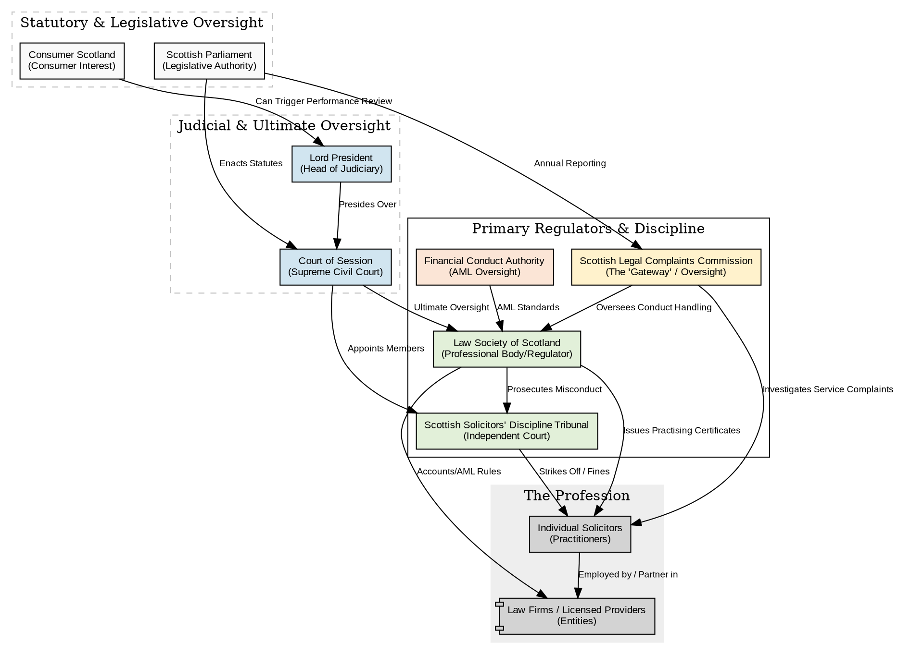
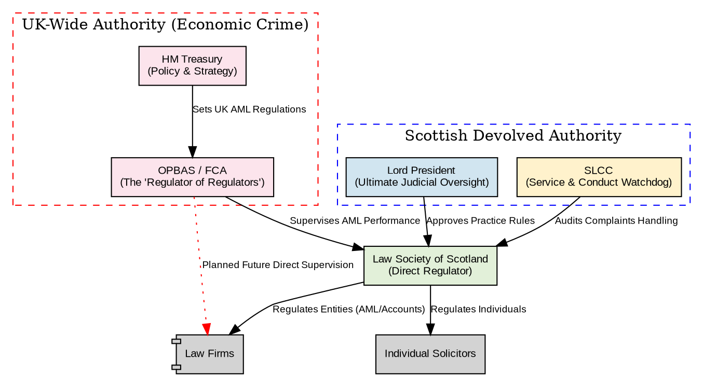

# Meta Governance: How Authority Chains Control Issuer Claims

## The Hash-as-Endorsement Principle

When an endorser (e.g., HMRC) authorizes an issuer (e.g., a pub), they hash the issuer's **entire** `verification-meta.json` and store that hash at their own endpoint. This single mechanism binds everything in the meta — the description, claim type, response types, authority basis — to the endorsement.

```
Issuer serves:  https://r.the-red-lion.co.uk/verification-meta.json
Endorser stores: https://hmrc.gov.uk/vat/{sha256-of-that-json}  →  {"status":"verified"}
```

The endorser doesn't need to separately approve each field. By hashing the whole JSON, they've signed off on every byte. Any change to any field produces a different hash, and the old endorsement no longer applies.

## Descriptions Are Not Marketing Copy

The `description` field in `verification-meta.json` is displayed to end users alongside the issuer's domain name:

```
✓ r.the-red-lion.co.uk (Pub and restaurant, Amersham, Bucks)
  ✓ hmrc.gov.uk (Confirms VAT registration of UK businesses)
    ✓ gov.uk (Oversees all official verification chains in the UK)
```

Because the endorser hashes this description, they have effective veto power over its content. This creates a natural constraint: **descriptions should be factual, stable, and boring**.

A pub is "Pub and restaurant, Amersham, Bucks" — not "Award-winning gastropub with artisanal craft ales and a sun-drenched beer garden." HMRC would rightly refuse to re-endorse a meta that changes quarterly to match the latest marketing campaign, because every change requires them to compute a new hash and store it.

The practical result:
- **Issuers** write short, factual descriptions (business type, location)
- **Endorsers** approve once and rarely revisit
- **Users** see stable, trustworthy text that isn't trying to sell them anything

This is a feature, not a limitation. The description exists to help a verifier understand what they're looking at, not to promote the business.

## Description Updates Require Re-endorsement

If the Red Lion legitimately changes — say, from "Pub, Amersham" to "Pub and restaurant, Amersham" after adding a kitchen — the process is:

1. Red Lion updates their `verification-meta.json` with the new description
2. Red Lion submits the updated meta to HMRC for re-endorsement
3. HMRC hashes the new meta and stores the new hash
4. Red Lion starts serving the new meta

The old meta hash can be removed from HMRC's endpoint immediately after step 4. There is no need for both to be live simultaneously, because:

**Receipt hashes are independent of meta hashes.** A receipt from last year hashes to the same value regardless of what the current meta says. The meta hash only proves "HMRC endorses this issuer right now" — it doesn't retroactively affect any previously verified document. Step 2 of verification (checking the authority chain) always uses whatever meta is *currently* served.

## What the Endorser Actually Approves

By hashing the entire `verification-meta.json`, the endorser implicitly approves:

| Field | What it means |
|---|---|
| `issuer` | The entity's name |
| `description` | How they describe themselves (displayed to users) |
| `claimType` | What kind of documents they issue |
| `responseTypes` | What statuses they can return (verified, revoked, refunded, etc.) |
| `authorityBasis` | Their stated basis for authority (if present) |

If any of these are misleading, the endorser can refuse to hash. A fish-and-chip shop claiming `"claimType": "MedicalLicense"` wouldn't get past HMRC. This is soft governance — there's no schema enforcement, just the endorser's willingness to endorse.

## Self-Certified Issuers

Not every issuer needs an authority chain. Well-known brands can be self-certified:

```
✓ r.costa.co.uk (Costa Coffee)
```

No `authorizedBy` field, no chain to walk. The verifier decides whether `r.costa.co.uk` is credible for a Costa Coffee receipt. For household-name brands, domain ownership is sufficient proof.

The description constraint still applies — but it's self-imposed. Costa has no endorser to refuse a marketing-heavy description, but they also have no incentive to game it. The description is tiny text in a verification panel, not a billboard.

## The Endorser's Governance Burden

Endorsers (regulators, government bodies) take on a lightweight governance role:

- **Initial approval:** Review the issuer's meta, confirm the description and claim type are accurate, hash it, store it
- **Ongoing:** Do nothing, unless the issuer requests a change
- **On change:** Review the new meta, re-hash, replace the old hash
- **On deregistration:** Remove the hash (verification chain breaks, signalling the issuer is no longer endorsed)

This is deliberately minimal. The endorser doesn't need to understand the issuer's business logic, verify individual documents, or maintain any state beyond a set of hashes. The computational cost is negligible — one SHA-256 per issuer, updated rarely.

## Root Authorities

The pattern recurses. HMRC's own meta is hashed by `gov.uk`, which means gov.uk has approved HMRC's description ("Confirms VAT registration of UK businesses") and role. Gov.uk is the root — its meta is self-certified, and its credibility comes from jurisdictional authority, not domain namespace.

This is an important distinction. The authority chain is about **jurisdictional oversight**, not DNS hierarchy. The FCA's domain is `fca.org.uk` — not a subdomain of `gov.uk` — but the FCA is still `authorizedBy: "gov.uk/v1"` because the FCA exists by Act of Parliament. The chain traces *who granted the authority to operate*, not who owns the parent domain.

Root authority descriptions should reflect this. They state what the entity is, not what it claims to do:

```
✓ r.the-red-lion.co.uk (Pub and restaurant, Amersham, Bucks)
  ✓ hmrc.gov.uk (Confirms VAT registration of UK businesses)
    ✓ gov.uk (UK government — root of trust)
```

The root's description is deliberately minimal — "UK government — root of trust" rather than "Oversees all official verification chains." The root doesn't need to justify itself in a description field. Its authority is self-evident from the domain.

```
Issuer meta       →  hashed by endorser  →  hashed by root
(description,        (description,           (self-certified,
 claimType, etc.)     role, etc.)             jurisdictional authority)
```

Each level controls the claims of the level below it, through the same hash-the-whole-meta mechanism. No special protocol, no certificates, no key management — just SHA-256 and HTTP.

## The Root Store: ~300 Recognised Roots

A chain can terminate at any domain that has no `authorizedBy` field. Without a curated list of recognised roots, a malicious chain could terminate at `trustme.example.com` claiming `"role": "root-authority"` and the UI would show the same green checkmarks as a genuine government root.

The solution is a static root store shipped with the app — analogous to the ~150 root CA certificates that browsers ship for TLS. The root store for Live Verify is a list of recognised jurisdictional roots, roughly 300 entries:

- **~195 countries** — national roots (`gov.uk`, `usa.gov`, `gov.au`, `gobierno.mx`, etc.)
- **~50 US states and territories** — state-level roots (`ny.gov`, `ca.gov`, `tx.gov`, etc.)
- **~30 federated sub-national jurisdictions** — Canadian provinces, German Länder, Australian states, Swiss cantons — where sub-national governments have independent regulatory authority
- **A handful of supranational bodies** — EU institutions, UN agencies

This is a manageable list. It changes slowly — new countries don't appear often. It can be maintained as a JSON file in the app, updated with app releases. The app would distinguish between chains terminating at a recognised root (full confidence) and chains terminating at an unrecognised domain (the chain is intact but the root is not in the store — the user decides).

Importantly, the root store only contains roots. The hundreds of thousands of issuers and the hundreds of endorsers (regulators, professional bodies) don't need to be listed. They're discovered dynamically by walking the chain. The root store just answers the final question: "does this chain end somewhere I trust?"

## One Entity, Multiple Chains

A single entity can have multiple `vfy:` endpoints, each with a different authority chain for a different type of claim. The authority chain is per-claim, not per-entity.

Take a Scottish pub:

- `vfy:r.pub-elebben.scot` → hmrc.gov.uk/vat → gov.uk (VAT registration)
- `vfy:food.pub-elebben.scot` → foodstandards.gov.scot → gov.scot (food hygiene)
- `vfy:employer.pub-elebben.scot` → hmrc.gov.uk/paye → gov.uk (PAYE employer)

Or a Scottish law firm:

- `verify:macleod-fraser.co.uk/certs` → lawscot.org.uk → gov.scot (individual solicitor's practising certificate)
- `verify:macleod-fraser.co.uk/firm` → lawscot.org.uk → gov.scot (firm/partnership registration)
- `verify:macleod-fraser.co.uk/aml` → lawscot.org.uk → OPBAS/FCA → HM Treasury → gov.uk (AML compliance)

The Law Society of Scotland maintains two separate registers — individual solicitors and firms — so these are two distinct claims even though they go through the same chain. A solicitor's practising certificate moves with them if they change firms; a firm's registration persists regardless of which solicitors work there.

The third chain for AML goes through UK-wide authority because anti-money laundering is reserved to Westminster, not devolved. Same firm, different claim, different root. Each chain is a straight line — the question is always: "for *this specific thing*, who's the direct endorser?"

This keeps the model simple despite arbitrarily complex regulatory landscapes.

## Regulatory Complexity vs. Chain Simplicity

Real regulatory structures are messy. Scottish solicitors, for example, are subject to overlapping oversight:



Where UK-wide authority intersects with devolved Scottish authority:



The authority chain doesn't try to capture this full graph. It captures one straight line through it: **who directly endorses this specific verification endpoint**. For a practising certificate, that's:

```
✓ macleod-fraser.co.uk/certs (Solicitors, Edinburgh)
  ✓ lawscot.org.uk (Regulates solicitors in Scotland)
    ✓ gov.scot (Scottish Government — root of trust)
```

The Court of Session, SLCC, SSDT, Scottish Parliament, OPBAS, and FCA all have roles in regulating solicitors — but none of them are in this chain because none of them directly endorse Macleod Fraser's verification-meta.json. The chain answers "who vouches for this specific claim?" not "who has regulatory jurisdiction over this entity?"

If Macleod Fraser also needed to verify AML compliance, that would be a separate `vfy:` endpoint with a separate chain going through the UK-wide AML regulators to `gov.uk`. Same firm, different claim, different chain, potentially different root.

## Peer Relationships Between Endorsers Are Out of Scope

When the Law Society of Scotland strikes off a solicitor, HMRC might also need to know (the firm may owe tax). When HMRC deregisters a business for VAT, the Law Society might need to know (the firm's accounts are suspect).

These peer relationships between endorsers exist — but they don't belong in the verification meta or the authority chain. The chain is strictly hierarchical: issuer → endorser → root. How endorsers coordinate with each other is an operational matter between regulators, not something the verification system needs to model or that end users need to see.

Regulators already have statutory duties to share information (e.g., the Legal Profession and Legal Aid (Scotland) Act 2007 requires the Law Society to report certain matters to the Lord President). These obligations predate Live Verify and will continue to operate through existing channels — MoUs, data-sharing agreements, statutory reporting. Adding a `peers` field to verification-meta.json would be over-engineering a problem that's already solved elsewhere.

The authority chain answers one question: "is this claim endorsed right now?" Whether the endorser learned about a change from its own records, from a peer regulator, or from a statutory notification doesn't affect the verification result. The chain is a snapshot of trust at the moment of verification, not a model of how that trust is maintained.
